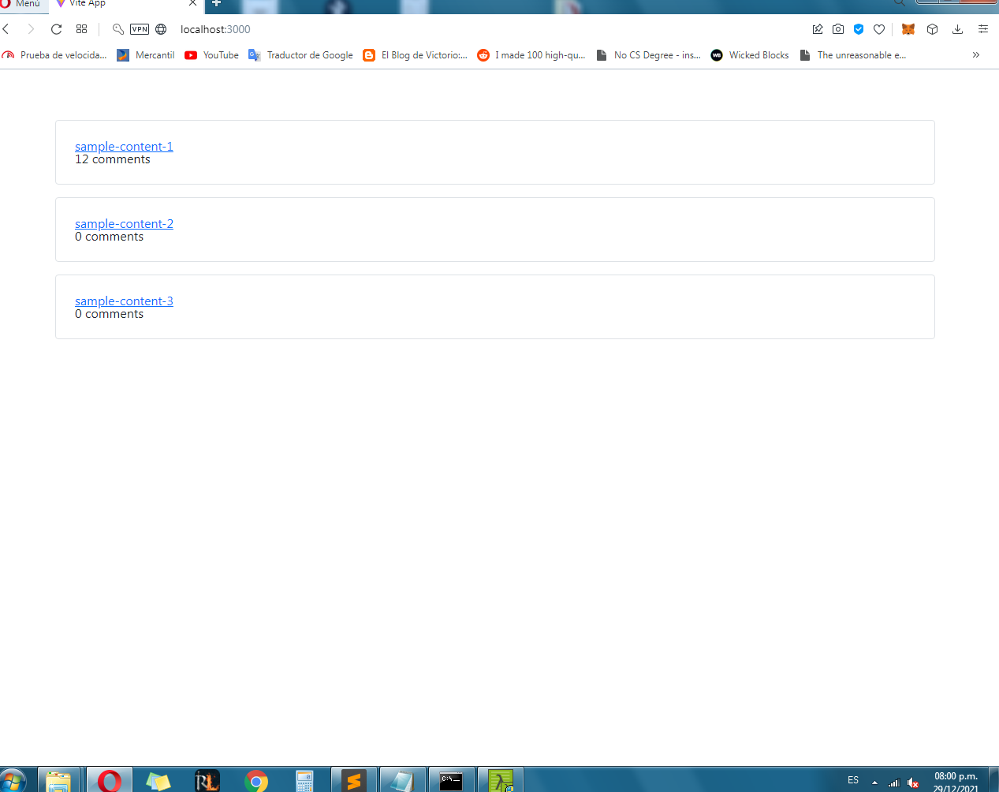

# Sample project that showcases the strapi-comment-client library

This project showcases how to use the library [strapi-comment-client](https://npmjs.com/package/strapi-comments-client) from start to finish, using authenticated users to post comments and a router to group comments on their own pages.

## Requirements

You must have a running Strapi V4 application and it must have installed the [Strapi Comment Manager plugin](https://npmjs.com/package/strapi-plugin-comment-manager).

Additionally, you must enable the permissions to access the endpoints. More info on this here: https://npmjs.com/package/strapi-plugin-comment-manager

## Setting up and running

To get up and running just install the dependencies through `npm install` and then open up your browser at http://localhost:3000.

